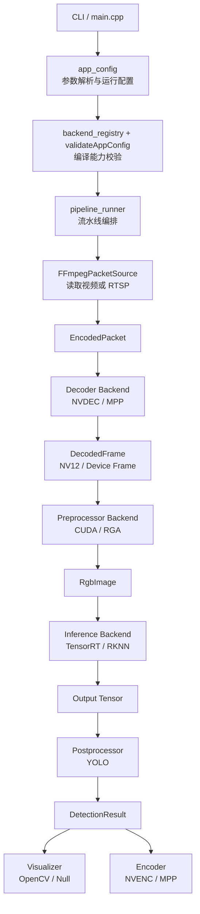

# vision-inference-pipeline

一个面向 **Rockchip** 与 **NVIDIA** 平台的视觉推理部署骨架，聚焦后端适配、运行链路与工程化集成。

## 项目定位

- 这是一个偏**部署工程**的项目，不是训练或算法研究仓库。
- 重点在于打通 `FFmpeg -> Decoder -> Preprocess -> Inference -> Postprocess` 的完整视频推理链路。
- 核心价值是承载 **RKNN / TensorRT** 等部署后端接入，并提供可扩展的端到端运行骨架。
- 适合作为视频推理系统、边缘 AI 部署、跨平台视觉工程的作品集项目。

## 支持的硬件后端

| 平台 | 解码器 | 预处理 | 推理 |
|------|--------|--------|------|
| **Rockchip** (RK3588/RK3568) | MPP 硬解 | RGA | RKNN NPU |
| **NVIDIA** (GPU) | NVDEC 硬解 | CUDA | TensorRT |

## 快速开始

### Rockchip 平台

```bash
cmake -S . -B build-rockchip -DPLATFORM=rockchip
cmake --build build-rockchip -j4

# 最小运行
./build-rockchip/video_pipeline --backend rockchip test.mp4 yolov5s.rknn 640 640

# RTSP 输入
./build-rockchip/video_pipeline --backend rockchip \
  rtsp://127.0.0.1:554/stream \
  yolov5s.rknn 640 640
```

RTSP 输入说明：

- 输入源位置参数本身就支持 `rtsp://...`
- 当前输入端显式按 RTSP 打开，并优先使用 `TCP`
- 已设置低延迟/低缓冲打开参数；长时间断流自动重连仍未实现

### Rockchip 稳定参数

当前在 RK3588 上验证过的一组稳定参数：

```bash
/edge/workspace/vision-inference-pipeline/build-rockchip/video_pipeline \
  --backend rockchip \
  --infer-workers 2 \
  --rknn-zero-copy false \
  --progress-every 300 \
  --encoder-fps 30 \
  --encoder-bitrate 20000000 \
  --output-video /edge/workspace/vis_modelzoo_full.h264 \
  /edge/workspace/2_h264_clean.mp4 \
  /edge/workspace/rk-video-pipeline-cpp/models/stall_int8.rknn \
  640 640
```

说明：

- `--infer-workers 2` 是当前比较稳的吞吐/稳定性折中
- `--rknn-zero-copy false` 是当前带框输出路径的稳态选项
- `--encoder-fps 30` 用来避免把异常高输入帧率原样写进输出导致慢放/卡顿
- `--output-video` 在 Rockchip 路径下支持裸码流 `.h264/.h265`、`.mp4`，也可以改用 `--output-rtsp rtsp://...`
- 默认 `--output-overlay cpu` 走现有稳定的 CPU 画框 + RGA 颜色转换 + MPP 编码链路
- `--output-overlay rga` 走可选的硬件叠加路径：
  `NV12 -> RGA RGBA scratch -> RGA blend -> RGA NV12 -> MPP encode`
- 当前 `rga` 模式已经在板端跑通，但如果后续更换 `librga` / driver 组合，优先重新做一遍板端回归

封装成 mp4 时只做封装，不重编码：

```bash
ffmpeg -y -framerate 30 -i /edge/workspace/vis_modelzoo_full.h264 -c copy /edge/workspace/vis_modelzoo_full.mp4
```

如果要在板端重复做回归，直接执行：

```bash
/edge/workspace/vision-inference-pipeline/scripts/rockchip_output_regression.sh
```

如需切换到硬件叠加回归：

```bash
OUTPUT_OVERLAY_MODE=rga \
  /edge/workspace/vision-inference-pipeline/scripts/rockchip_output_regression.sh
```

### NVIDIA 平台

```bash
cmake -S . -B build -DPLATFORM=nvidia
cmake --build build -j4

# 运行
./build/video_pipeline --backend nvidia --verbose test.mp4 yolov5s.engine 640 640

# 带视频输出
./build/video_pipeline \
  --backend nvidia \
  --verbose \
  --visual-style yolo \
  --output-video out.mp4 \
  test.mp4 yolov5s.engine 640 640
```

当前 NVIDIA 路线代码已接入：

- FFmpeg demux
- NVDEC decode
- CUDA preprocess
- TensorRT inference
- YOLO postprocess
- OpenCV draw
- NVENC encode

`--verbose` 下会输出：

- `[PIPELINE] stages`
- `[PIPELINE] first_decoded_frame`
- `[TRT] input_binding`
- `[TRT] output_binding`
- `[TRT] input_mode`
- `[PIPELINE] init_annotated_encoder`

这些日志用于判断是否真正走到了 `NVDEC -> CUDA -> TensorRT -> NVENC` 硬件链路。

### 自动检测

```bash
cmake -S . -B build
cmake --build build -j4

# 运行时指定后端
./build/video_pipeline --backend rockchip test.mp4 model.rknn
./build/video_pipeline --backend nvidia test.mp4 model.engine
```

## 命令行参数

```
Usage: video_pipeline [options] <video_or_rtsp> <model_file> [width] [height]

Options:
  --backend <rockchip|mpp|nvidia|nvdec>  选择后端平台
  --gpu <id>                              GPU 设备 ID
  --infer-workers <n>                     推理 worker 数量
  --progress-every <n>                    每 n 帧打印一次进度日志 (默认：30)
  --rknn-core-mask <mask>                 auto|0|1|2|0_1|0_2|1_2|0_1_2|all
  --max-frames <n>                        最大处理帧数 (默认：0，表示不限)
  --conf-threshold <f>                    置信度阈值
  --nms-threshold <f>                     NMS 阈值
  --labels-path <path>                    标签文件
  --letterbox <true|false>                是否启用 letterbox
  --rknn-zero-copy <true|false>           RKNN 优先使用 DMA RGB 输入
  --model-output-layout <name>            auto|yolov8_flat_8400x84|yolov8_rknn_branch_6|yolov8_rknn_branch_9|yolo26_e2e(当前不支持)
  --verbose                               打开详细日志
  --dump-first-frame                      导出第一帧推理输入
  --display                               打开显示窗口
  --display-max-width <n>                 显示路径最大宽度
  --display-max-height <n>                显示路径最大高度
  --output-overlay <cpu|rga>              输出视频叠加方式
  --visual-style <classic|yolo>           检测框/标签绘制风格（默认：yolo）
  --output-video <path>                   输出带框视频
  --output-rtsp <url>                     输出带框 RTSP 推流
  --encoder-output <path>                 输出原始解码视频流
  --encoder-codec <h264|h265>             编码格式
  --encoder-bitrate <bps>                 编码码率
  --encoder-fps <n>                       编码帧率 (默认：0 = 跟随输入，异常高帧率时内部会回落)
  -h, --help                              显示帮助
```

## Visual Styles

当前提供两种绘制风格：

- `classic`
  - 保留原有框线 + 纯文字标签样式
- `yolo`
  - 使用 YOLO 常见的实心标签底框样式

示例：

```bash
./build/video_pipeline --visual-style classic test.mp4 model.engine 640 640
./build/video_pipeline --visual-style yolo test.mp4 model.engine 640 640
```

说明：

- OpenCV 可视化路径支持 `classic` 和 `yolo`
- Rockchip RGA overlay 路径也接入了风格分支

## 环境变量

| 变量 | 说明 |
|------|------|
| `VIDEO_DECODER_BACKEND` | 解码器后端 (mpp/nvdec/cpu) |
| `VIDEO_PREPROC_BACKEND` | 预处理后端 (rga/cuda/cpu) |
| `VIDEO_INFER_BACKEND` | 推理后端 (rknn/trt) |
| `CUDA_DEVICE` | CUDA 设备 ID |

## 目录结构

```
vision-inference-pipeline/
├── include/
│   ├── decoder_interface.hpp    # 解码器接口
│   ├── preproc_interface.hpp    # 预处理接口
│   ├── infer_interface.hpp      # 推理接口
│   ├── postproc_interface.hpp   # 后处理接口
│   ├── detection.hpp            # 检测结果结构体
│   ├── pipeline_types.hpp       # 共享数据类型
│   ├── ffmpeg_packet_source.hpp # FFmpeg 解复用
│   └── backends/
│       ├── mpp_decoder.hpp      # Rockchip MPP 解码
│       ├── nvdec_decoder.hpp    # NVIDIA NVDEC 解码
│       ├── rga_preprocessor.hpp # Rockchip RGA 预处理
│       ├── cuda_preprocessor.hpp# CUDA 预处理
│       ├── rknn_infer.hpp       # RKNN 推理
│       ├── trt_infer.hpp        # TensorRT 推理
│       └── yolo_postproc.hpp    # YOLO 后处理
│
├── src/
│   ├── main.cpp                 # 统一入口
│   ├── ffmpeg_packet_source.cpp
│   └── backends/
│       ├── mpp_decoder.cpp
│       ├── nvdec_decoder.cpp
│       ├── rga_preprocessor.cpp
│       ├── cuda_preprocessor.cpp
│       ├── rknn_infer.cpp
│       ├── trt_infer.cpp
│       ├── yolo_postproc.cpp     # YOLO 后处理实现
│       ├── decoder_factory.cpp
│       ├── preproc_factory.cpp
│       ├── infer_factory.cpp
│       └── postproc_factory.cpp
│
├── models/
│   └── coco_labels.txt          # COCO 80 类标签
│
├── CMakeLists.txt
├── LICENSE
└── README.md
```

## 构建选项

| 选项 | 默认 | 说明 |
|------|------|------|
| `PLATFORM` | auto | 目标平台 (auto/rockchip/nvidia) |
| `ENABLE_MPP_DECODER` | ON | Rockchip MPP 解码器 |
| `ENABLE_NVDEC_DECODER` | ON | NVIDIA NVDEC 解码器 |
| `ENABLE_RGA_PREPROC` | ON | Rockchip RGA 预处理 |
| `ENABLE_CUDA_PREPROC` | ON | CUDA 预处理 |
| `ENABLE_RKNN_INFER` | ON | RKNN 推理 |
| `ENABLE_TRT_INFER` | ON | TensorRT 推理 |

## 依赖

### Rockchip 平台
- FFmpeg (libavformat, libavcodec, libavutil)
- Rockchip MPP (`rockchip_mpp`)
- Rockchip RGA (`rga`)
- RKNN Runtime (`rknnrt`)

### NVIDIA 平台
- FFmpeg (libavformat, libavcodec, libavutil)
- CUDA Toolkit
- TensorRT

## 处理流程

```
┌─────────────┐     ┌─────────────┐     ┌─────────────┐     ┌─────────────┐     ┌─────────────┐
│  FFmpeg     │────▶│  Decoder    │────▶│ Preprocessor│────▶│  Inference  │────▶│ Postprocess │
│  Demux      │     │ (MPP/NVDEC) │     │ (RGA/CUDA)  │     │ (RKNN/TRT)  │     │ (YOLO NMS)  │
└─────────────┘     └─────────────┘     └─────────────┘     └─────────────┘     └─────────────┘
```

## 支持的 YOLO 模型

| 模型 | 输出格式 | NMS |
|------|----------|-----|
| YOLOv8 单头 | 单输出 dense tensor，例如 `(batch, 84, 8400)` | 走单头 dense 路线 |
| YOLOv8 多头 | RKNN Model Zoo 常见 branch outputs | 走多头 branch 路线 |
| YOLO26 FP16 单头 | 单输出 dense tensor | 走单头 dense 路线 |
| YOLO26 INT8 多头 | 多个 head 输出，后处理与 YOLOv8 branch 路径一致 | 走多头 branch 路线 |
| YOLO26 End-to-End | `(batch, 300, 6)` / `yolo26_e2e` | **当前不支持** |

## 已知限制

- 这是"最小可改造工程骨架"，不是完整生产工程
- CUDA 预处理需要完整实现零拷贝路径
- Rockchip 标注输出当前支持裸 `.h264/.h265`、`.mp4` 与 `rtsp://` 推流
- NVIDIA `--output-video` 现已通过 FFmpeg mux 写容器；代码路径已接通，但仍建议在目标机上用 `ffprobe` 做首轮验证
- 输入视频帧率异常高时，Rockchip 输出路径会按目标编码帧率做丢帧，避免输出慢放
- Rockchip 带框输出当前优先保证稳定性，不追求端到端零拷贝
- RTSP 长时间断流重连尚未实现

## Current NVIDIA Status

当前 NVIDIA 路线代码状态：

```text
FFmpeg demux
  -> NVDEC decode
  -> CUDA preprocess
  -> TensorRT inference
  -> CPU postprocess
  -> OpenCV draw
  -> NVENC encode
```

已经落地的点：

- `PLATFORM=nvidia` 默认打开 `NVDEC + CUDA preproc + TensorRT + NVENC`
- CUDA 预处理已支持 letterbox
- TensorRT 已支持多输出结构化返回
- TensorRT 输入会优先走设备侧路径，并在 `--verbose` 打印 `input_mode`
- NVENC 已改为通过 FFmpeg mux 写文件

仍需目标机验证的点：

- 不同 FFmpeg / CUDA / 驱动组合下的 `AV_PIX_FMT_CUDA` surface 兼容性
- 具体 TensorRT engine 的输入 dtype / layout 组合
- `.mp4` 输出在目标机上的实际封装与回放兼容性

## Rockchip 当前状态

当前主链路已经验证可跑通：

```text
FFmpeg demux
  -> MPP decode
  -> RGA preprocess
  -> RKNN inference
  -> CPU postprocess
  -> CPU draw
  -> RGA RGB->YUV420SP
  -> MPP H.264 encode
```

当前 Rockchip 路径已处理的问题：

- `maxFrames` 默认值修正为 `0`
- FFmpeg bitstream filter drain / EOF 处理
- RKNN core mask 自动分配
- RGA buffer group limit
- MPP 输出首帧强制 IDR
- MPP 初始化切换到官方推荐的 `MPP_ENC_GET_CFG / MPP_ENC_SET_CFG`
- 带框输出的卡顿、黑边、黑线问题已收敛到可稳定运行
- `--output-overlay rga` 已切换到 `imcvtcolor + imblend + imcvtcolor` 路径，避开了直接 YUV alpha composite 的黑屏问题

## License

MIT License - 详见 [LICENSE](LICENSE) 文件

## 整体架构图



```text
主数据流:
InputSource -> EncodedPacket -> DecodedFrame -> RgbImage -> Output Tensor -> DetectionResult

NVIDIA 路线:
FFmpeg -> NVDEC -> CUDA Preproc -> TensorRT -> YOLO -> OpenCV / NVENC

Rockchip 路线:
FFmpeg -> MPP -> RGA -> RKNN -> YOLO -> OpenCV / MPP
```
## Showcase Scope

This repository is positioned as a deployment-oriented portfolio project:

- hardware-aware video inference pipeline
- backend capability validation
- RKNN / TensorRT deployment integration
- deployment tradeoff comparison across Rockchip and NVIDIA targets

Related material:

- deployment comparison: [docs/deployment_comparison.md](docs/deployment_comparison.md)
- benchmark project: [vision-inference-benchmark](https://github.com/t0ugh-sys/vision-inference-benchmark)
