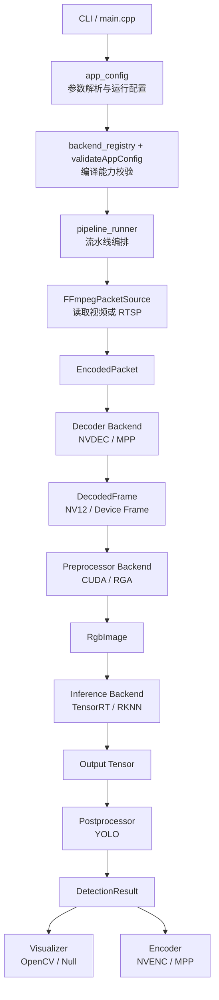

# vision-inference-pipeline

> 面向 RK3588 / NVIDIA GPU 的高性能视频推理部署框架
> 覆盖 硬解码 → 预处理 → 推理 → 后处理 → 编码 完整链路

## 架构


```mermaid
flowchart TD
    CLI[CLI / main.cpp] --> CONFIG[app_config<br/>参数解析与运行配置]
    CONFIG --> VALIDATE[backend_registry + validateAppConfig<br/>编译能力校验]
    VALIDATE --> RUNNER[pipeline_runner<br/>流水线编排]

    RUNNER --> SRC[FFmpegPacketSource<br/>读取视频或 RTSP]
    SRC --> PKT[EncodedPacket]
    PKT --> DECODER[Decoder Backend<br/>NVDEC / MPP]
    DECODER --> FRAME[DecodedFrame<br/>NV12 / Device Frame]
    FRAME --> PREPROC[Preprocessor Backend<br/>CUDA / RGA]
    PREPROC --> IMAGE[RgbImage]
    IMAGE --> INFER[Inference Backend<br/>TensorRT / RKNN]
    INFER --> TENSOR[Output Tensor]
    TENSOR --> POST[Postprocessor<br/>YOLO]
    POST --> DET[DetectionResult]
    DET --> VIS[Visualizer<br/>OpenCV / Null]
    DET --> ENC[Encoder<br/>NVENC / MPP]
```

## 性能数据

| 平台 | 模型 | 精度 | 延迟 | FPS | 功耗 | FPS/W |
|------|------|------|------|-----|------|-------|
| NVIDIA GPU | YOLOv8n | FP32 | 7.5ms | 136 | ~200W | 0.68 |
| NVIDIA GPU | YOLO26n | FP32 | 8.5ms | 119 | ~200W | 0.60 |
| NVIDIA GPU (TensorRT) | YOLOv8n | INT8 | ~2-3ms | ~300-500 | ~200W | ~2.0 |
| RK3588 NPU | YOLOv8n | INT8 | ~28ms | ~35 | ~5W | **7.0** |

> 详细数据见 [benchmarks/results/](benchmarks/results/comparison_table.md)

## 支持的硬件后端

| 模块 | Rockchip | NVIDIA |
|------|----------|--------|
| 解码 | MPP (VPU) | NVDEC |
| 预处理 | RGA | CUDA |
| 推理 | RKNN NPU | TensorRT |
| 编码 | MPP Encoder | NVENC |
| 可视化 | CPU OpenCV | OpenCV |

## 支持的模型

| 模型 | 输出格式 | 后处理 |
|------|----------|--------|
| YOLOv8 单头 | `(batch, 84, 8400)` | 单头 dense |
| YOLOv8 多头 | RKNN branch outputs | 多头 branch |
| YOLO26 FP16 单头 | 单输出 dense tensor | 单头 dense |
| YOLO26 INT8 多头 | 多个 head 输出 | 多头 branch |

## 快速开始

### Rockchip (RK3588)

```bash
cmake -S . -B build-rockchip -DPLATFORM=rockchip
cmake --build build-rockchip -j4

./build-rockchip/video_pipeline --backend rockchip test.mp4 yolov8n.rknn 640 640
```

### NVIDIA

```bash
cmake -S . -B build -DPLATFORM=nvidia
cmake --build build -j4

./build/video_pipeline --backend nvidia --verbose test.mp4 yolov8n.engine 640 640
```

> 环境配置详见 [docs/rk3588_setup.md](docs/rk3588_setup.md) 和 [docs/tensorrt_setup.md](docs/tensorrt_setup.md)

## 完整命令行参数

```
Usage: video_pipeline [options] <video_or_rtsp> <model_file> [width] [height]

Options:
  --backend <rockchip|mpp|nvidia|nvdec>  选择后端平台
  --gpu <id>                              GPU 设备 ID
  --infer-workers <n>                     推理 worker 数量
  --progress-every <n>                    每 n 帧打印一次进度日志 (默认：30)
  --rknn-core-mask <mask>                 auto|0|1|2|0_1|0_2|1_2|0_1_2|all
  --max-frames <n>                        最大处理帧数 (默认：0，表示不限)
  --conf-threshold <f>                    置信度阈值
  --nms-threshold <f>                     NMS 阈值
  --labels-path <path>                    标签文件
  --letterbox <true|false>                是否启用 letterbox
  --rknn-zero-copy <true|false>           RKNN 优先使用 DMA RGB 输入
  --model-output-layout <name>            auto|yolov8_flat_8400x84|yolov8_rknn_branch_6|yolov8_rknn_branch_9
  --verbose                               打开详细日志
  --dump-first-frame                      导出第一帧推理输入
  --display                               打开显示窗口
  --output-overlay <cpu|rga>              输出视频叠加方式
  --visual-style <classic|yolo>           检测框/标签绘制风格（默认：yolo）
  --output-video <path>                   输出带框视频
  --output-rtsp <url>                     输出带框 RTSP 推流
  --encoder-output <path>                 输出原始解码视频流
  --encoder-codec <h264|h265>             编码格式
  --encoder-bitrate <bps>                 编码码率
  --encoder-fps <n>                       编码帧率
  -h, --help                              显示帮助
```

## Visual Styles

```bash
./build/video_pipeline --visual-style classic test.mp4 model.engine 640 640
./build/video_pipeline --visual-style yolo test.mp4 model.engine 640 640
```

## RTSP 输入

输入源支持 `rtsp://...`，默认 TCP 传输。可通过环境变量调整：

| 变量 | 说明 |
|------|------|
| `VIP_RTSP_TRANSPORT` | `tcp` 或 `udp` |
| `VIP_RTSP_STIMEOUT_US` | 超时时间（微秒） |
| `VIP_RTSP_LOW_DELAY` | `true` 或 `false` |

## 测试

```bash
cd build-rockchip
ctest -R "(app_config_test|yolo_postproc_test|validate_app_config_test)" --output-on-failure
```

## 文档

| 文档 | 说明 |
|------|------|
| [架构设计](docs/architecture.md) | 模块关系、数据流、接口模式 |
| [构建指南](docs/build_guide.md) | 编译依赖、构建命令、选项说明 |
| [RK3588 环境配置](docs/rk3588_setup.md) | NPU 驱动、MPP、RGA、RKNN 安装 |
| [TensorRT 环境配置](docs/tensorrt_setup.md) | CUDA、cuDNN、TensorRT 安装 |
| [部署对比](docs/deployment_comparison.md) | Rockchip vs NVIDIA 选型分析 |
| [Benchmark 数据](benchmarks/results/) | 跨平台性能测试结果 |

## 目录结构

```
vision-inference-pipeline/
├── include/                    # 头文件
│   ├── backends/               # 后端实现头文件
│   ├── decoder_interface.hpp   # 解码器接口
│   ├── preproc_interface.hpp   # 预处理接口
│   ├── infer_interface.hpp     # 推理接口
│   ├── postproc_interface.hpp  # 后处理接口
│   └── ...
├── src/                        # 源代码
│   ├── backends/               # 后端实现
│   ├── main.cpp                # 入口
│   └── pipeline_runner.cpp     # 流水线编排
├── models/                     # 模型文件 (不提交到 git)
├── scripts/                    # 回归测试脚本
├── tests/                      # 单元测试
├── docs/                       # 文档
├── benchmarks/results/         # 性能测试数据
├── third_party/rknn/           # RKNN SDK (头文件 + 下载说明)
└── CMakeLists.txt
```

## 依赖

### Rockchip
- FFmpeg (libavformat, libavcodec, libavutil)
- Rockchip MPP
- Rockchip RGA
- RKNN Runtime (见 [third_party/rknn/README.md](third_party/rknn/README.md))

### NVIDIA
- FFmpeg (with NVDEC/NVENC)
- CUDA Toolkit >= 11.0
- TensorRT >= 8.0

## 构建选项

| 选项 | 默认 | 说明 |
|------|------|------|
| `PLATFORM` | auto | 目标平台 (auto/rockchip/nvidia) |
| `ENABLE_MPP_DECODER` | ON | Rockchip MPP 解码器 |
| `ENABLE_NVDEC_DECODER` | ON | NVIDIA NVDEC 解码器 |
| `ENABLE_RGA_PREPROC` | ON | Rockchip RGA 预处理 |
| `ENABLE_CUDA_PREPROC` | ON | CUDA 预处理 |
| `ENABLE_RKNN_INFER` | ON | RKNN 推理 |
| `ENABLE_TRT_INFER` | ON | TensorRT 推理 |

## License

MIT License - 详见 [LICENSE](LICENSE) 文件
